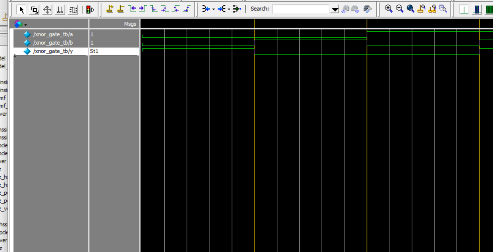

# Verilog XNOR Gate Simulation

This project implements an XNOR logic gate in Verilog, including a testbench, simulation waveform, and log output using ModelSim.

---

## 📁 Files

- `xnor_gate.v` — Verilog module for XNOR gate  
- `xnor_gate_tb.v` — Testbench for simulation  
- `monitor_log.txt` — Simulation output log  
- `wave_XNOR_tb.png` — Waveform screenshot from ModelSim


wave_XNOR_tb.png — Waveform screenshot from ModelSim
---

## ✅ Test Cases

| a | b | y (a ~^ b) |
|---|---|------------|
| 0 | 0 | 1          |
| 0 | 1 | 0          |
| 1 | 0 | 0          |
| 1 | 1 | 1          |

---

## 📷 Waveform

> Screenshot of the waveform generated from ModelSim



---

## 🖥️ Simulation Commands (ModelSim)

```tcl
vlib work
vlog src/xnor_gate.v tb/xnor_gate_tb.v
vsim work.xnor_gate_tb
add wave *
run -all

🔍 Notes
Ensure the paths to xnor_gate.v and xnor_gate_tb.v are correct relative to your working directory.
Make sure $dumpfile and $dumpvars are properly set in your testbench to generate the .vcd file.

---

### ✅ Commit message 建議：

Add Verilog XNOR gate, testbench, log and waveform

